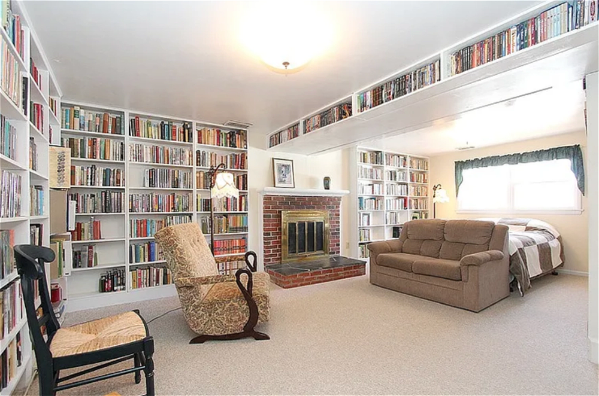

My mother read to me almost every night before I was 6. In first grade, I remember learning to read. I have a memory of the word “look” and thinking that it looked like two eyes – looking! I started checking out books from our elementary school library in Lancaster, PA. My 3rd grade teacher told my mother that I was reading too much. She must have seen all the library books I always had. My mother told my father what the teacher had said. He replied, in his deep voice: “Let him read.” And that was that!

We had Scholastic Book Club (SBC) books starting in elementary school, where you could place an order in class and a month later get some cool paperback books, specially made for SBC. I would also read old SBC books that my brothers had previously purchased. My oldest brother somehow got hold of a *Tom Swift Jr.* series book and before finding out that there were others in the series, I read *Tom Swift and the Cosmic Ray Astronauts* about eight times. I read my other brother’s one *Chip Hilton* book, *Freshman Quarterback*, about the same number of times. Then I found these and other series books available at the Lancaster County Public Library children’s section – and feasted.

The Lancaster, PA public library was a beautiful old building in the heart of the town, with the children’s section on the second floor. I remember hurrying past the first-floor books for adults and taking the back winding stairs. On the second floor, I had to walk a dimly-lit hallway past mysterious closed doors (e.g., one was marked “Board Room”), past glass display cases, and then into the brightly-lit children’s room. Every week my mother took my two brothers to their nearby violin lessons. I was allowed to spend an hour in the library and come home with a large stack of books. After several years, I found out that the library had a basement, where all the non-fiction adult books were kept. It was gloomy, with many dim rows of stacks. I wandered down one day and remember seeing a book on a shelf with the mysterious and somehow intriguing title: “Quantum Mechanics.” Little did I know that one day I would become a physicist.

Every year, the Lancaster County Library collected books for their annual book sale. The aisles of the library’s first floor would be filled with temporary tables of books covered above and below with books. Starting in 8th grade, my mother would write an excuse for me to be late for school on the day of the sale. She would drop me off early at the library and I would get into the line outside the building. I did this all through high school. All books were 10 cents each when I started going to the sale. I still have a mathematical handbook from one of those early sales that I have used all through my scientific career.

Through the first four years of college at Michigan State University, I frequented a used bookstore in East Lansing, MI and bought books through the Science Fiction Book Club. Book buying slowed down a lot through graduate school, as we were quite tight with finances, living on a graduate research assistantship. As our kids came along, we moved to Gaithersburg, MD for a  job with the National Institute of Standards and Technology. The start of homeschooling suddenly accelerated my book buying, since we were trying to recreate a good school library in our home following Charlotte Mason’s concept of “real” or “living” books.

Many of our books in the 1990s were purchased at the Wheaton Regional Library monthly book sale, in Montgomery County, MD. The county public library system would gather all the weeded books from all their libraries and offer them for \$0.25 each in the library basement. The ambiance was like a not-so-small public library where you could just grab books off the shelves to keep! I would take our older children and they knew what to look for, Landmark books in particular. Since the books offered were ex-library books, most of them had a dust jacket which was usually reasonably well-preserved by a worn clear cover. Some of the books had splits inside the binding along a signature. I would remove the dust jacket and clear cover, glue and clamp the book, fix any rips in the cover, and put on a new dust jacket. When we found good books that we already had, our two older children made a little business selling these extra books to our homeschool friends, which taught them entrepreneurship. For the years that this book sale lasted, I felt that the Montgomery County library system was discarding Western civilization into our hands.

I started lining our basement family room with bookcase units. These shelf units came from our local used bookstore, which made custom book shelves out of pine wood backed by thin plywood. I would haul them home in our mini-van, where I painted them white and mounted them on bases and attached them to the walls of the basement. The picture shows a snapshot of our basement library in 2014. 

One time we had our Sunday School class (young-ish marrieds) over for a group dinner. We fixed up the basement library room like a restaurant, with small tables and tablecloths and candles, lit a fire in the fire place, and kept the lights dim. One dear lady said to me with wonder in her voice, "Do you polish your books?" All the new dust jackets gleamed on the shelves in the firelight!

We also found hundreds of books at the annual book sale put on by the Stone Ridge School of the Sacred Heart in Bethesda, MD, a Catholic boarding school for girls. The older children and I would leave home early in the morning to get in line near to the front (and wait for two hours) and then come home with about 100 books in an average year, though sometimes more. We would go early enough so that the only people in front of us were the dealers, who we grew to recognize over the years. We were in friendly competition with several homeschool ladies. Satisfaction with our place in the early morning line was only achieved if we were lined up ahead of them. I would jokingly tell my kids that their job was to block out these friends while I grabbed all the Landmark books. Highlights over the years included, of course, many Landmark books, many classics, and one year, a whole batch of around 30 Biggles books. The last time we went to this sale was in 2014, the year we were moving to Colorado. After arrival, we found out that the 2014 sale was going to be their last one. We said that they knew it wouldn’t be the same any more without us, which must be the real reason that the school ended the annual sale.

Most of the other books in our library came from the many used book stores that I visited while on business trips and family vacations. A particularly wonderful used book store was the Ohio Used Book Store in Cincinnati, OH. It was an old large townhouse with five floors of books. They had obviously bought whole school libraries. The children's section was arranged like quite a good size library, with high shelves arranged in several in forty-foot long stacks. The remaining books in our library were obtained through the website *abebooks.com*. I remember when *abebooks.com* first started up on the Internet. Suddenly, I easily found titles for which I had been looking in used book stores across the country over many years.

At the peak of our library, we had about 4000 books on the shelves lining the walls and ceiling of our basement family room. We lent many of them out to other families. Then, with our kids off to college or beyond, and with moving plans to Colorado, we started downsizing. We gave away about 800 books to our homeschool friends in MD. Some old favorites went to our children, mainly to our youngest daughter, who became a public librarian with her own personal library. However, we still moved almost 100 boxes of books to our new house in Arvada, CO. We built a new basement library, this time with IKEA Billy shelves, which seem to be popular with home libraries. We moved again in retirement, to Fort Lupton, CO, to be nearer to grandchildren, and gave away another 1000 books to local  homeschool families, although we kept many gems, including an almost complete American and World Landmark book collection.

We are now getting close to the end, of our library and of this narrative. I am very happy that our library is presently helping to build another living library, Sara Masarik’s Plumfield and The Shire libraries. In September, 2025 we gave about 400 books to her library. We will be sending more over the next few years but we have to make sure that our youngest grandchild first gets to read great series such as Freddy the Pig, The Ranger’s Apprentice, Dr. Dolittle, and the Famous Five. I am happy that our books, collected over many years with much effort, will go on to bless other generations of children. God gave us good books and now He has enabled us to pass them on to others. Thanks be to Him for good books, a prayer I have repeated many times over the last 50+ years.